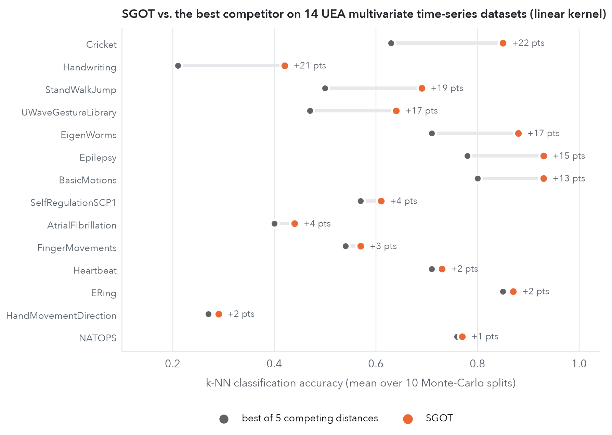

::: {.post-lede}
Machine learning runs on distances. Nearest neighbours, clustering, t-SNE, retrieval and averaging all need to know when two objects are close. For images and sentences we have plenty of good distances. For **dynamical systems** (a beating heart, a walking robot, the wake behind a bluff body, a folding protein) there has been no satisfying answer to the question *how far apart are these two systems?* This post is about the answer we give in our ICLR 2026 paper: a metric called **SGOT** (Spectral-Grassmann Optimal Transport). This is an exciting joint work with Thibaut Germain, Rémi Flamary and Karim Lounici at CMAP, École Polytechnique. It sits where optimal transport expertise meets the operator-learning program I have been developing for the last six years.
:::

::: {.callout-tip appearance="simple" icon="false"}
## TL;DR

- **Represent a system by its spectrum.** A Koopman/transfer operator breaks the dynamics into *modes*, and each mode has an eigenvalue (a timescale and a frequency) and an eigenspace (its shape). We treat a system as a **probability distribution over these spectral atoms**.
- **Compare systems by optimal transport.** SGOT is the Wasserstein distance between two such distributions, with a ground cost that mixes eigenvalue distance and **Grassmannian** distance between eigenspaces. We prove it is a **true metric**.
- **It measures what matters and ignores what doesn't.** It is invariant to how eigenpairs are ordered, to the basis the operator is written in, and to the **sampling rate** of the trajectories.
- **It can be learned from data.** Plugged into reduced-rank operator regression, the estimated distance converges at an explicit rate under assumptions **weaker** than those of earlier spectral learning theory.
- **It works in practice.** SGOT gets the best average rank on 14 multivariate time-series benchmarks with linear-kernel, Gaussian-kernel and deep-feature operator estimators. It also gives us **barycenters of dynamical systems**, so we can interpolate between two flows.
:::


## Why this is harder than it looks

The first idea is to compare the trajectories themselves. This fails almost immediately:

- two recordings of **the same system** started from different initial conditions can look nothing alike;
- a signal and its time-shifted copy are "far apart" pointwise but come from the same system;
- recordings made at **different sampling rates** or of **different lengths** can't even be put side by side.

What we actually want to compare is the *law of motion* that produced the data, not the data. The Koopman operator gives us a handle on exactly that.

## The Koopman lens: nonlinear dynamics, linear operator

Take a Markov process $(X_t)$ on a state space $\mathcal X$. It may be deterministic or stochastic, and it may be nonlinear. Instead of following states, follow **observables**, i.e. functions $f:\mathcal X\to\mathbb R$, and ask how their expected values evolve:

$$
[A_t f](x) \;=\; \mathbb E\big[f(X_t)\,\big|\,X_0=x\big].
$$

$A_t$ is the **transfer operator** (the **Koopman operator** for deterministic systems). The dynamics may be as nonlinear as they like, but $A_t$ is **linear**. The price is that it acts on an infinite-dimensional space of functions. Time-homogeneity gives a semigroup $A_{t+s}=A_tA_s$, so $A_t=e^{tL}$ for an **infinitesimal generator** $L$.

Linearity lets us use spectral theory. When the operator admits a spectral decomposition, every observable splits into modes that evolve independently:

$$
\mathbb E[f(X_t)\mid X_0=x] \;=\; \sum_{j} e^{\lambda_j t}\,\langle f, g_j\rangle\, f_j(x),
\qquad \lambda_j = \underbrace{\tau_j}_{\text{decay}} + i\,2\pi\underbrace{\omega_j}_{\text{frequency}} .
$$

Each mode has two ingredients:

- an **eigenvalue** $\lambda_j$, which says *how fast* the mode decays ($\operatorname{Re}\lambda_j$) and *how fast* it oscillates ($\operatorname{Im}\lambda_j$), in physical units of $\mathrm{s}^{-1}$ and Hz;
- an **eigenspace** $\mathcal V_j$, spanned by the left and right eigenfunctions $g_j,f_j$, which says *what the mode looks like* in state space (a vortex shedding pattern, a slow conformational change, a gait cycle).

::: {.column-margin}
**A musical analogy.** A dynamical system is like a chord. Every note has a pitch (frequency), a sustain (decay) and a timbre (eigenspace). Two chords are close when you can turn one into the other by shifting a few notes a little. They are not close just because their waveforms happen to line up at some instant.
:::

In practice $A_t$ is unknown and has to be learned from trajectories. Over the last few years we and others have developed ways to do this with guarantees: kernel and reduced-rank regression, deep representations, generator learning (see [my earlier post](../2024-12-30-current-research/index.qmd)). The question here comes *after* estimation: once each system has become an operator, how should we compare operators?

## Why the obvious distances fail

Suppose we have two estimated operators $T$ and $T'$ written in a common function space. Why not just take $\|T-T'\|$ in the Hilbert–Schmidt (Frobenius) or operator norm? The figure below shows what happens in a controlled experiment. The reference system is the sum of two harmonic oscillators, at 0.5 Hz and 1 Hz. We then move **one** of them: first its frequency (a), then its damping (b).

![**How distances react to controlled changes of a system.** Operators are estimated from noisy 200 Hz trajectories by reduced-rank regression. Each curve is normalised by its maximum. Norm-based distances are nearly blind to frequency changes close to the reference and then saturate. Comparing only eigenvalues ignores shapes, and comparing only eigenspaces saturates and even turns back down. SGOT increases steadily with the size of the change. Minimal re-implementation in the spirit of Fig. 1 of the paper, with $\eta=0.5$.](figs/sgot-shifts.png)

Three problems show up:

1. **Norms are not spectral.** $\|T-T'\|_{\mathrm{HS}}$ compares matrix entries in some basis. It does not "know" that shifting a frequency from 1.0 to 1.1 Hz is a small change and shifting it to 2.5 Hz is a large one. It saturates and can even oscillate.
2. **Spectra alone are not enough.** Two systems can share all their frequencies and decay rates and still have completely different mode shapes. Think of a vortex street behind a cylinder and behind a triangle. The eigenvalue-only curve in panel (a) is perfectly linear, but it would give distance zero to such systems.
3. **Sampling matters too much.** An operator estimated from data sampled every $\Delta t$ seconds has eigenvalues $e^{\lambda\Delta t}$, and those move around the unit circle when $\Delta t$ changes. Any distance built on the raw matrices therefore depends on how fast you happened to sample.

There is also a more basic obstacle. The natural home of $A_t$ is $L^2_\pi(\mathcal X)$, which depends on the invariant measure $\pi$, so **different systems live in different spaces**. We get around this by restricting all operators to one common reproducing kernel Hilbert space (RKHS) $\mathcal H$ that contains their leading eigenfunctions. That restriction is also exactly what our estimators produce.

## The idea: a system is a distribution of spectral atoms

A non-defective finite-rank operator is determined, **up to permutation**, by its list of eigenvalues and spectral projectors. So we encode $T$ as a probability measure over the space $\mathbb C\times\mathcal G$ of (eigenvalue, subspace) pairs:

$$
\mu(T) \;=\; \sum_{j=1}^{\ell} \frac{m_j}{m_{\text{tot}}}\;\delta_{(\lambda_j,\ \mathcal V_j)},
$$

where $m_j$ is the multiplicity of $\lambda_j$ and $\mathcal V_j$ is the $m_j$-dimensional subspace of Hilbert–Schmidt operators spanned by the rank-one operators $f\otimes g$ built from its right and left eigenfunctions. Each Dirac is a **spectral atom**. Next we need a way to measure the distance between two atoms:

$$
d_\eta\big((\lambda,\mathcal V),(\lambda',\mathcal V')\big) \;=\; \eta\,\underbrace{|\lambda-\lambda'|}_{\text{timescales \& frequencies}} \;+\; (1-\eta)\,\underbrace{\|P_{\mathcal V}-P_{\mathcal V'}\|_{\mathrm{HS}}}_{\text{Grassmannian distance of shapes}},\qquad \eta\in(0,1).
$$

The second term is a distance on the **Grassmannian**, the manifold of subspaces. It compares two subspaces through their orthogonal projectors. For one-dimensional subspaces meeting at a principal angle $\theta$, it equals $\sqrt2\,\sin\theta$. It does not depend on the basis in which the subspaces are written, and it is blind to how the eigenvectors are normalised or rotated.

::: {.kv-keyidea}
::: {.kv-kicker}
The definition
:::
$$
d_{\mathcal S}(T,T') \;=\; W_{d_\eta,\,p}\big(\mu(T),\,\mu(T')\big)
\;=\; \Big(\min_{P\in\Pi(\mu(T),\,\mu(T'))}\ \sum_{i,j} d_\eta\big((\lambda_i,\mathcal V_i),(\lambda'_j,\mathcal V'_j)\big)^p P_{ij}\Big)^{1/p}.
$$
SGOT is the cheapest way to **transport** the spectral atoms of one system onto those of the other, where moving an atom costs the change in its timescale and frequency plus the rotation of its eigenspace.
:::

Optimal transport is the right tool here because a coupling $P$ does not care in which **order** the eigenpairs were listed. Permutation invariance comes for free, and projectors make the metric basis-free.

**Theorem 1 (metric).** Let $\mathcal H$ be a separable complex Hilbert space and $\mathcal S_r(\mathcal H)$ the non-defective operators of rank at most $r$. Then $(\mathcal S_r(\mathcal H), d_{\mathcal S})$ is a **metric space**.

The proof is short but has a subtle step in infinite dimensions. The map $T\mapsto\mu(T)$ is injective. The Wasserstein distance is a metric on measures over a **Polish** (separable, complete metric) space. What remains is to show that the Grassmannian of subspaces of dimension at most $r$ inside an infinite-dimensional separable Hilbert space, with the Hilbert–Schmidt projector distance, is itself separable and complete. The usual operator-norm distance between subspaces fails to be separable, which is why the construction uses Hilbert–Schmidt projectors. The construction can be extended to defective operators via the Dunford–Jordan decomposition, by comparing Jordan blocks instead of eigenspaces.

**Sampling-rate invariance.** Trajectories sampled every $\Delta t_k$ give operators whose eigenvalues are $e^{\lambda\Delta t_k}$. Before comparing, SGOT maps each one back to the **generator eigenvalue** $\lambda=\log(\nu)/\Delta t_k$, which is in physical units. A system recorded at 100 Hz and the same system recorded at 300 Hz therefore sit at the same place in the (decay, frequency) plane. Only SGOT and the pure Grassmannian distance stay flat in the paper's sampling-rate experiment.

**It is cheap.** Given kernel-based estimates of two operators, the cost matrix only needs cross-kernel matrices between the two datasets:

$$
C_{ij}=\eta|\lambda_i-\lambda'_j|+(1-\eta)\Big(m_i+m_j-2\,\mathrm{Tr}\big((\beta_i^*M_y\beta'_j)(\alpha_i^*M_x\alpha'_j)\big)\Big)^{1/2},
$$

where $\alpha,\beta$ hold the coefficients of the left and right eigenfunctions and $M_x,M_y$ are cross-Gram matrices. The total cost is $O(n^2r^2+r^3\log r)$. That is the same order as computing a kernel Hilbert–Schmidt distance, and the transport problem is tiny because it only has $r\times r$ entries. In the paper's classification benchmark, one SGOT evaluation took **0.12 ms**, against 4.96 ms for the Hilbert–Schmidt distance and 13 ms for the operator norm.

## Can we trust a distance computed from data?

In practice we never have $T_1$ and $T_2$, only estimates $\widehat T_1,\widehat T_2$ learned from finite trajectories. A distance is useful for machine learning only if $d_{\mathcal S}(\widehat T_1,\widehat T_2)$ is close to $d_{\mathcal S}(T_1,T_2)$ with high probability. Our second result gives a rate for this.

We use **reduced-rank regression (RRR)** in an RKHS, $\widehat T_k=(\widehat C^k_x+\gamma I)^{-1/2}[\![(\widehat C^k_x+\gamma I)^{-1/2}\widehat C^k_{xy}]\!]_{r_k}$. It is the rank-constrained, Tikhonov-regularised least-squares solution of predicting the next state's features from the current ones, and $[\![\cdot]\!]_r$ is truncation to the top $r$ singular values.

**Theorem 2 (learning the metric, informal).** Assume the covariance eigenvalues decay polynomially, $\lambda_i(C_x)\lesssim i^{-1/\beta}$ with $\beta\in[0,1]$, and that a source condition of order $\alpha\in[1,2]$ holds, i.e. the operator is "regular" relative to the kernel. Assume also that the spectrum discarded by the rank truncation decays fast enough, $\operatorname{Re}\lambda_{r_k}\lesssim -\tfrac{\alpha\log n}{2(\alpha+\beta)}$. Then with probability at least $1-\delta$,

$$
\big|d_{\mathcal S}(\widehat T_1,\widehat T_2)-d_{\mathcal S}(T_1,T_2)\big| \;\lesssim\; n^{-\frac{\alpha-1}{2(\alpha+\beta)}}\ \ln(2\delta^{-1}).
$$

::: {.column-margin}
**Reading the exponent.** $\alpha$ measures how well the operator aligns with the kernel (smoothness); $\beta$ measures the effective dimension of the features. With a very regular problem ($\alpha=2$) and fast spectral decay ($\beta\to0$) the rate approaches $n^{-1/4}$.
:::

What's new here is the **assumption set**. Earlier sharp spectral rates for Koopman learning[^sharp] needed the *whole* transfer operator to be **well specified**, i.e. to have an exact representation in the RKHS. That is a strong requirement. For Langevin dynamics with a Gaussian kernel, for example, it fails. What does hold is that finitely many **leading eigenfunctions** of the generator lie in the RKHS. We only assume this (Assumption A3: $\operatorname{Im}(P_{\le r_k}L_k)\subset\mathcal H$). The price is a truncation bias $e^{\lambda_{r_k}}$, which the condition above pushes below the statistical noise level.

The proof has three steps, and each one is instructive:

1. **Operator error.** Split $\|T_k-\widehat T_k\|$ into bias and variance. The bias is $\lesssim\gamma^{(\alpha-1)/2}+e^{\lambda_{r_k}}$ (regularisation plus discarded spectrum). The variance is $\lesssim\sqrt{\gamma^{-\beta-1}n^{-1}}\log\delta^{-1}$, from concentration inequalities for RRR. Choosing $\gamma\asymp n^{-1/(\alpha+\beta)}$ balances the two.
2. **Spectral perturbation.** Davis–Kahan-type arguments turn the operator error into errors on eigenvalues and spectral projectors, scaled by eigenvalue gaps and condition numbers of the eigenvectors. A short polar-coordinates lemma then controls the (decay, frequency) coordinates.
3. **Wasserstein stability.** The triangle inequality gives $|d_{\mathcal S}(\widehat T_1,\widehat T_2)-d_{\mathcal S}(T_1,T_2)|\le W_p(\mu(T_1),\mu(\widehat T_1))+W_p(\mu(T_2),\mu(\widehat T_2))$. Coupling each true atom with its estimate (the "identity" transport plan) bounds each term by the average atom-wise error.

So estimating the *distance* is no harder than estimating the *operators*. Optimal transport adds no statistical cost.

## Does it help machine learning?

We took **14 multivariate time-series datasets** from the UEA archive, covering motion capture, gestures, EEG/ECG, handwriting and more. Every time series became an operator estimated by RRR, and we ran a $k$-NN classifier with each candidate distance. We compared against the Hilbert–Schmidt and operator norms, the classical Martin distance for linear systems, and two OT baselines: one on eigenvalues only (SOT) and one on eigenspaces only (GOT).



The advantage holds whichever estimator produces the operators:


Some details worth pointing out:

- The gains are largest where the dynamics have **several interacting modes**: Cricket (0.63 → 0.85), Handwriting (0.21 → 0.42), StandWalkJump (0.50 → 0.69), EigenWorms (0.71 → 0.88). These are the cases where eigenvalue-only and subspace-only comparisons each discard half of the information.
- In t-SNE embeddings of the cross-distance matrix, SGOT produces visibly separated class clusters. Norm-based distances produce an undifferentiated cloud.
- The trade-off parameter $\eta$ has a principled default. Setting $\bar\eta=(1+f_{\text{samp}}/(2\sqrt2))^{-1}$ makes the eigenvalue term and the Grassmannian term equally important. Accuracy varies smoothly around this value, and the best values tend to put more weight on eigenspaces.

## Averaging dynamical systems

A metric gives more than nearest neighbours. It also gives **means**. The **Fréchet barycenter** of systems $T_1,\dots,T_N$ with weights $\gamma_i$ is

$$
T_\star \;\in\; \arg\min_{T\in\mathcal S_r(\mathcal H)}\ \sum_{i=1}^N \gamma_i\, d_{\mathcal S}(T,T_i)^2 .
$$

With two systems and weights $(1-\gamma,\gamma)$, moving $\gamma$ from 0 to 1 **interpolates** between them. Why not just average the matrices, $(1-\gamma)T_0+\gamma T_1$? That is the Hilbert–Schmidt barycenter, and the widget below shows what goes wrong with it.

```{=html}
<div class="kv-widget" id="sgot-morph">
  <p class="kv-title">Try it: morph one oscillator into another</p>
  <p class="kv-sub">System A oscillates at 0.2 Hz and is barely damped. System B oscillates at 0.8 Hz and is damped at 0.25 s⁻¹. Drag γ to move from A to B, and change the sampling rate at which the transfer operators were estimated.</p>
  <div class="kv-controls">
    <label>γ <input type="range" id="sm-gamma" min="0" max="1" step="0.01" value="0.5" aria-label="interpolation weight gamma"><output id="sm-gamma-out">0.50</output></label>
    <span>sampling rate&nbsp; <span class="kv-seg"><button type="button" data-fs="2" class="on">2 Hz</button><button type="button" data-fs="4">4 Hz</button><button type="button" data-fs="10">10 Hz</button><button type="button" data-fs="50">50 Hz</button></span></span>
  </div>
  <div class="kv-panels">
    <svg id="sm-disc" viewBox="0 0 320 320" role="img" aria-label="Transfer-operator eigenvalues on the unit disc with the two interpolation paths"></svg>
    <svg id="sm-sig" viewBox="0 0 540 320" role="img" aria-label="Impulse responses of the interpolated systems"></svg>
  </div>
  <div class="kv-legend"><span><span class="kv-swatch" style="background:#eb6834"></span>SGOT barycenter (solid)</span><span><span class="kv-swatch" style="background:#5f6368"></span>linear average of operators (dashed)</span><span><span class="kv-swatch" style="background:#2a78d6"></span>A</span><span><span class="kv-swatch" style="background:#1baf7a"></span>B</span></div>
  <table class="kv-readout" id="sm-readout"><thead><tr><th>system</th><th>frequency (Hz)</th><th>damping (1/s)</th></tr></thead><tbody></tbody></table>
</div>
<script src="morph-widget.js"></script>
```

The geometry is simple. A transfer-operator eigenvalue $e^{\lambda\Delta t}$ lies on or inside the unit circle, and its distance from the circle encodes damping. Linear averaging moves eigenvalues along a **chord**, which cuts through the interior of the disc and so **invents damping** that neither system has. The amount it invents depends on the sampling rate. At 2 Hz the "halfway" system is damped about five times more than the more damped of its two parents; at 50 Hz the effect nearly disappears. SGOT moves each atom along a straight line in (decay, frequency) coordinates, which is an **arc** on the disc. The frequencies and decay rates are interpolated, and the answer does not depend on how the data were sampled. This is the operator analogue of McCann's displacement interpolation in optimal transport. It "moves the mass" rather than "blending the pixels".

Computing SGOT barycenters for general operators takes some work, because the unknown must stay an operator *with a spectral decomposition*. We parametrise the barycenter through kernel expansions of its eigenfunctions,

$$
T_\theta\, h \;=\; \sum_{i=1}^{r}\lambda_i\,\langle \kappa_{\mathbf x}\alpha_i, h\rangle_{\mathcal H}\;\kappa_{\mathbf x}\beta_i,
\qquad \alpha^*K\beta=I,\quad \beta_j^*K\beta_j=1,
$$

and run an **inexact block-coordinate descent**. Each cycle first solves the small transport problems, then takes a few gradient steps on the eigenvalues, the control points and the right eigenfunctions (with normalisation), and finally updates the left eigenfunctions. The last step includes a projection onto the biorthogonality constraint $\alpha^*K\beta=I$, and that projection has a **closed form** derived from the KKT conditions. On the two-oscillator example, the unconstrained Hilbert–Schmidt barycenter is over-damped. The spectrally constrained Hilbert–Schmidt barycenter gets stuck near its initialisation. The SGOT barycenter interpolates frequencies and decays linearly and is about **6× faster per gradient step**.

Here is a less trivial example. We took two incompressible Navier–Stokes flows from the FlowBench *flow past a bluff body* dataset, one past a **cylinder** and one past a **triangle**, estimated a Koopman operator for each, and computed their SGOT barycenter:


## Why I think this matters

**1. A geometry on the space of dynamical systems.** With a metric that is spectrally meaningful, invariant to nuisance factors and cheap, learned operators become **data points**. We can cluster them, retrieve them, embed them, average them and interpolate between them. This is the basic infrastructure for machine learning *over* dynamical systems, as opposed to *of* a single system. A first step beyond barycenters is our follow-up on **dictionary learning of dynamical systems with optimal transport** ([arXiv:2605.18276](https://arxiv.org/abs/2605.18276)), which learns a small set of characteristic spectral "atoms" shared across related systems.

**2. It is physically interpretable.** SGOT compares what a physicist would compare: timescales, frequencies and mode shapes, in physical units. When two systems are far apart, the optimal transport plan tells you *which modes* are responsible and *how* they differ.

**3. It is learnable.** The metric comes with finite-sample guarantees that hold under realistic misspecification. The kernel does not have to represent the whole operator, only its leading spectral part.

**4. It works with any estimator.** Kernels, dictionaries, or deep features trained to learn invariant representations: SGOT only needs eigenvalues and eigenfunctions.

Many of the systems we care about in AI for science are now summarised by learned operators: molecular kinetics, climate modes, fluid surrogates, robot locomotion. A principled distance between them seems to me a missing piece for comparing simulations, organising their latent spaces and averaging them into useful priors.

## Paper, code and citation

::: {.callout-note appearance="simple" icon="false"}
**A Spectral-Grassmann Wasserstein metric for operator representations of dynamical systems**<br>
Thibaut Germain, Rémi Flamary, Vladimir R. Kostić, Karim Lounici. *International Conference on Learning Representations (ICLR), 2026.*<br>
[OpenReview](https://openreview.net/forum?id=B02EqvyiF3) · [arXiv:2509.24920](https://arxiv.org/abs/2509.24920)
:::

::: {.kv-cite}
```bibtex
@inproceedings{germain2026sgot,
  title     = {A Spectral-Grassmann Wasserstein metric for operator
               representations of dynamical systems},
  author    = {Germain, Thibaut and Flamary, R{\'e}mi and
               Kostic, Vladimir R. and Lounici, Karim},
  booktitle = {International Conference on Learning Representations (ICLR)},
  year      = {2026},
  url       = {https://openreview.net/forum?id=B02EqvyiF3}
}
```
:::

*About the figures:* the hero figure and the "how distances react" figure come from a short NumPy re-implementation (linear kernel, reduced-rank regression, η = 0.5), written for this post and in the spirit of the paper's experiments. The classification charts re-plot numbers from the paper's tables. The fluid-flow figure is taken from the paper.

[^sharp]: V. R. Kostić, K. Lounici, P. Novelli, M. Pontil. *Sharp spectral rates for Koopman operator learning.* NeurIPS 2023.
