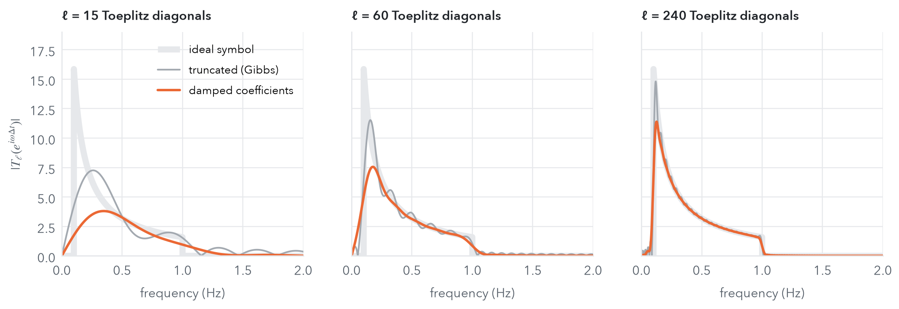

::: {.post-lede}
Numerical linear algebra has spent seventy years getting good at eigenvalues. Shift-and-invert, Krylov subspaces, Chebyshev filtering and contour integrals all turn a hard spectral problem into an easy one. **Every one of these solutions assumes you can apply the matrix.** In data-driven dynamics you can't. The operator whose spectrum you want is only known through a trajectory, because the equations of motion are unknown. In our new paper with Karim Lounici and Massimiliano Pontil we show that these two worlds are much closer than they look: **the functional calculus of the generator turns into Toeplitz linear algebra on the trajectory's time-lagged statistics.**
:::

::: {.callout-tip appearance="simple" icon="false"}
## TL;DR

- **Shifting in time is a shift matrix.** In expectation, the transfer operator acts on a time-ordered data matrix by shifting its columns. So any polynomial or Laurent series in the transfer operator acts as a **banded Toeplitz matrix**.
- **Choose a symbol, get a filter.** A Toeplitz symbol $T$ defines an analytic function of the generator, $F(L)=T(e^{\Delta tL})$. Examples are the Koopman operator, hyperbolic sine and cosine, resolvents, band-limited inverses and Chebyshev filters, and **all of them are learned by one estimator**: reduced-rank regression on Toeplitz-weighted time-lagged covariances.
- **Structure by design.** A self-adjoint symbol gives estimated eigenvalues that are exactly real; a skew-symmetric one gives eigenvalues that are exactly imaginary.
- **Guarantees and speed.** The estimators are statistically consistent for β-mixing processes, and both primal and dual algorithms run on fast (sparse or FFT) Toeplitz products.
- **Results.** On a noisy Duffing oscillator, a band-limited filter forecasts accurately at **rank 10**, where standard Hankel-DMD/RRR collapses to the mean. On the chaotic attractor, resolvent filters reveal more spectral structure than eigen-decomposition-based estimates.
:::


## The operators behind a trajectory

Take a Markov process $(X_t)_{t\ge0}$ in $\mathbb R^d$, for example an Itô diffusion $dX_t=a(X_t)\,dt+b(X_t)\,dW_t$ or its deterministic limit $b=0$. Its **transfer operators** $A_tf=\mathbb E[f(X_t)\mid X_0=\cdot\,]$ act on observables in $L^2_\pi$, where $\pi$ is the invariant distribution. They form a semigroup $A_t=e^{tL}$, whose **generator** $L$ is a differential operator; for diffusions $Lf=\nabla f^\top a+\tfrac12\mathrm{Tr}(b^\top\nabla^2 f\,b)$. The spectrum of $L$ holds the physics: relaxation rates, metastable states, oscillation frequencies. What that spectrum looks like depends on the kind of dynamics:

| dynamics | generator | spectrum of $L$ |
|---|---|---|
| reversible stochastic (e.g. overdamped Langevin) | self-adjoint | real, $\le 0$; a spectral gap sets the slowest relaxation |
| non-reversible stochastic (e.g. underdamped Langevin, advection–diffusion) | **sectorial** | in a sector $\{\operatorname{Re}z\le0,\ |\operatorname{Im}z|\le-\operatorname{Re}z\tan\theta\}$ |
| deterministic on a simple attractor (limit cycle) | skew-adjoint | discrete, on the imaginary axis |
| deterministic, chaotic | skew-adjoint | **continuous**, filling $i\mathbb R$; only Ruelle–Pollicott resonances remain as discrete objects |
: {.kv-table .striped tbl-colwidths="[36,18,46]"}

In low dimension, $L$ can be discretised by finite elements. In high dimension (molecular dynamics, climate) that runs into the curse of dimensionality, and the equations are often unknown anyway. The data-driven alternatives (DMD, EDMD, Hankel-DMD, reduced-rank regression) estimate a single operator, $A_{\Delta t}=e^{\Delta tL}$, from snapshot pairs. Most of them can be read as projection or Arnoldi-type methods. **Can we estimate other functions of $L$ from the same data?** Resolvents, spectral projectors and filters are what numerical analysts would reach for, and each one exposes a different part of the spectrum.

## The one-line observation

Sample a trajectory at spacing $\Delta t$ and pass it through a feature map $\phi$ into a hypothesis space $\mathcal H$ (a dictionary of functions or an RKHS). The adjoint of the transfer operator is **the expected shift in time**, $\ \mathbb E[\phi(X_{(i+j)\Delta t})\mid X_{i\Delta t}]=A^*_{j\Delta t}\phi(X_{i\Delta t})$. Applied to the whole time-ordered data matrix, this reads

$$
\mathbb E\Big[A^*_{j\Delta t}\,\big[\phi(X_{\Delta t})\,|\,\phi(X_{2\Delta t})\,|\cdots|\,\phi(X_{\ell\Delta t})\,|\,0\,|\cdots|\,0\big]\Big]
\;=\;\mathbb E\big[\phi(X_{\Delta t})\,|\,\phi(X_{2\Delta t})\,|\cdots|\,\phi(X_{n\Delta t})\big]\,D_{-j},
$$

where $D_{-j}$ is the matrix with ones on a single diagonal. In words, **applying the operator is the same as shifting the columns.** A weighted sum $\sum_j a_j A^*_{j\Delta t}$ is therefore, in expectation, a **banded Toeplitz matrix** multiplying the data matrix from the right.

::: {.kv-keyidea}
::: {.kv-kicker}
The central idea
:::
The functional calculus of the generator of the dynamics becomes **structured linear algebra** on the transfer operator semigroup. Polynomial, Chebyshev or trigonometric expansions of $F$ turn into banded Toeplitz matrices whose diagonals are indexed by time lags and whose entries are the expansion coefficients.
:::


## Symbols are spectral filters

Take a Toeplitz **symbol** $T(z)=\sum_{j\in\mathbb Z}a_jz^j$ on the unit circle, extended to the disc by $T(z)=a_0+\sum_{j\ge1}(a_jz^j+a_{-j}\bar z^{\,j})$, and define

$$
F(L)\;:=\;T\big(A_{\Delta t}\big)\;=\;T\big(e^{\Delta tL}\big).
$$

$F(L)$ has **the same eigenfunctions** as $L$. Every eigenvalue is remapped, $\lambda\mapsto T(e^{\Delta t\lambda})$. So picking a symbol is like **designing a filter**: it decides which modes get amplified and which get suppressed. Low-rank estimators capture the *dominant* part of the spectrum of whatever operator they target, so the filter also decides **which modes you end up learning**. The paper works out a catalogue of useful symbols:

| operator $F(L)$ | Toeplitz symbol | dominant spectrum | built for |
|---|---|---|---|
| $e^{\Delta tL}$ (Koopman / transfer) | $z$ | right-most | any stable dynamics |
| $\cosh(\Delta tL)$ | $(z+z^{-1})/2$ | lowest frequencies / slowest modes | deterministic on simple attractors (real spectrum by design); reversible stochastic, where it equals $A_{\Delta t}$ |
| $\sinh(\Delta tL)$ | $(z-z^{-1})/2$ | highest frequencies | deterministic (imaginary spectrum by design) |
| $(e^{\mu}-e^{\Delta tL})^{-1}$ | $(e^\mu-z)^{-1}$ (von Neumann series) | closest to $\mu$ | general stable; non-normal transients |
| $(\mu-L)^{-1}$ | $(\mu-\operatorname{Ln}z)^{-1}$ (Laplace transform, trapezoid rule) | closest to $\mu$ | general stable, including small $\Delta t$ |
| $P_{(\omega_1,\omega_2)}L_0^{-1}$ | $\dfrac{\mathbb 1_{\text{band}}(\arg z)}{\operatorname{Ln}z}$ | frequencies in the band | deterministic on simple attractors |
| general $F$ | trigonometric / Chebyshev filters | largest $|F|$ | general deterministic, including chaotic |
: {.kv-table .striped tbl-colwidths="[20,20,17,43]"}


The widget below makes this concrete on the Duffing limit cycle used in the experiments further down. There the generator is skew-adjoint and its eigenvalues are the harmonics $\lambda=ik$ of the forcing frequency. A filter keeps the eigenfunctions and only re-weights the eigenvalues to $F(ik)$. A rank-$r$ estimator then targets the $r$ eigenvalues of $F(L)$ with the largest modulus.

```{=html}
<div class="kv-widget" id="tk-explorer">
  <p class="kv-title">Try it: which harmonics does a rank-r estimator learn?</p>
  <p class="kv-sub"><b>Top:</b> the weight |F(ik)| each filter gives to the harmonic λ = ik, for k up to the Nyquist frequency (Δt = 0.1 s). Orange bars are the r eigenvalues a rank-r estimator keeps. <b>Bottom:</b> how much of the observable x(t) actually lives in each harmonic, computed from the simulated limit cycle. A good filter keeps the harmonics where the signal is.</p>
  <div class="kv-controls">
    <span class="kv-seg"><button type="button" data-filter="koop" class="on">Koopman e^(ΔtL)</button><button type="button" data-filter="sinh">sinh(ΔtL)</button><button type="button" data-filter="res">resolvent (μ−L)⁻¹</button><button type="button" data-filter="band">band-limited 0.1–1 Hz</button></span>
    <label>rank r <input type="range" id="tk-rank" min="2" max="20" step="1" value="10" aria-label="rank"><output id="tk-rank-out">10</output></label>
    <label id="tk-theta-wrap">lens at θ = Im μ <input type="range" id="tk-theta" min="0" max="30" step="0.5" value="1" aria-label="resolvent shift"><output id="tk-theta-out">1.0</output></label>
  </div>
  <svg id="tk-chart" viewBox="0 0 620 366" role="img" aria-label="Filter weights and signal energy per harmonic" style="width:100%;height:auto;display:block;background:#fff;border:1px solid #eef0f2;border-radius:8px"></svg>
  <p class="kv-margin" id="tk-out"></p>
  <p class="kv-note" id="tk-note"></p>
</div>
<script src="filter-widget.js"></script>
```

At rank 10 this toy picture predicts what the experiment shows. Koopman leaves the choice to noise, the hyperbolic sine spends its rank on harmonics that carry no signal, and the band-limited filter keeps the fundamental and its first few harmonics.

## Learning a filter = weighting time-lagged covariances

To learn $F(L)$ from data we pose the linear inverse problem of finding $G:\mathcal H\to\mathcal H$ such that $F(L)J_\pi S_\pi=J_\pi S_\pi G$. Here $S_\pi$ embeds $\mathcal H$ into $L^2_\pi$ and $J_\pi$ removes the constant (stationary) mode. The solution has a very simple form.

**Proposition.** Let $C_j=\mathbb E\big[(\phi(X_0)-\mathbb E\phi)\otimes(\phi(X_{j\Delta t})-\mathbb E\phi)\big]$ be the lag-$j$ cross-covariance. Then $G_{\mathcal H}=C_0^{\dagger}W_a$ with

$$
W_a \;=\; a_0C_0+\sum_{j\ge1}\big(a_j\,C_j+a_{-j}\,C_j^*\big),
$$

the **$a$-weighted time-lagged covariance**.

This is good news for statisticians, because time-lagged covariances are among the most basic statistics of a time series. Equivalently, $G$ minimises the mean-squared error of predicting a **Toeplitz-weighted target**, $\psi_a(X_0)=\sum_j a_j\phi(X_{j\Delta t})$, from $\phi(X_0)$. For self-adjoint generators the target mixes symmetric lags $|j|$. For skew-adjoint (deterministic) ones it mixes the future *and the past*, which uses time-reversal equivariance.

With data, we replace each $C_j$ by its empirical version, regularise, and constrain the rank. This gives the reduced-rank regression (RRR) estimator

$$
\widehat G^{\,r}_{a,\gamma}=(\widehat C_0+\gamma I)^{-1/2}\,\big[\!\big[(\widehat C_0+\gamma I)^{-1/2}\,\widehat W_a\big]\!\big]_r,
\qquad \widehat W_a=a_0\widehat C_0+\textstyle\sum_{|j|\le\ell}\big(a_j\widehat C_j+a_{-j}\widehat C_j^*\big).
$$

Computing it is pure numerical linear algebra.

- **Primal** ($\dim\mathcal H=m\le n$): solve the generalised symmetric eigenproblem $WW^\top v_i=\sigma_i^2C_\gamma v_i$ with $W=\tfrac1n ZJ_nT_nJ_nZ^\top$, then diagonalise a small $r\times r$ matrix $V_r^\top WV_r$. Cost: $O\big(mn\,(m\vee(\ell\wedge\log n))\big)$, using sparse or FFT Toeplitz products.
- **Dual** (kernels, possibly infinite-dimensional $\mathcal H$): solve $T_n\overline K T_n^{H}\overline K u_i=\sigma_i^2\overline K_\gamma u_i$ on centred Gram matrices. Lanczos or Davidson methods compute only the $r\ll n$ leading pairs, and randomised solvers bring the cost down further.
- **Structure by construction.** If the Toeplitz matrix $T_n$ is self-adjoint, the estimated eigenvalues are real. If it is skew-adjoint, they are purely imaginary. A deterministic system's spectrum stays on the imaginary axis because of the algebra, not by luck.

Once an eigentriple $(\hat\nu_i,\hat g_i,\hat h_i)$ of $F(L)$ is estimated, inverting the filter, $\hat\lambda_i=F^{-1}(\hat\nu_i)$, gives the generator's eigenvalues. That in turn gives a forecast from a single trajectory:

$$
\mathbb E[h(X_t)\mid X_0=x]\;\approx\;\sum_{i\le r}e^{\hat\lambda_i t}\,\langle\hat g_i,h\rangle_{\mathcal H}\,\hat h_i(x).
$$

## Why it works: Crouzeix, mixing and consistency

Two things need to be controlled: the error from **truncating** the symbol to finitely many lags ($|j|\le\ell$), and the **statistical** error from dependent samples.

**Truncation.** For normal generators, $\|F(L)-F_\ell(L)\|$ is at most the sup of $|F-F_\ell|$ on the spectrum. For non-normal generators the spectrum alone says little, and here a famous result helps. **Crouzeix's theorem** says the numerical range is a $(1+\sqrt2)$-spectral set. Its recent extension to unbounded sectorial operators gives

$$
\|f(L)\|\;\le\;\kappa_\theta\max_{z\in\mathbb C^-_\theta}|f(z)|,\qquad \kappa_\theta\le1+\sqrt2,
$$

so the truncation error is at most $(1+\sqrt2)$ times the sup of $|F-F_\ell|$ over the sector.

::: {.column-margin}
**β-mixing** (absolute regularity): the joint law of the past and of the far future approaches the product of their laws, in total variation, as the gap grows. Deterministic systems fit this framework too, with all the randomness in the initial condition.
:::

**Theorem (consistency).** Suppose the process is β-mixing, the symbol $T$ is analytic near the relevant spectral set (spectrum or numerical range), and $T_\ell\to T$. Then the Hilbert–Schmidt error $\|F(L)S_\pi-S_\pi\widehat G^{\,r}_{a,\gamma}\|$ goes to zero in probability as the number of lags, the blocking parameters and the sample size grow. The estimated eigenvalues then converge to points of the spectrum of $F(L)$, and when the limit is a simple eigenvalue, the eigenfunctions converge as well.

The proof splits the error into a symbol-truncation term, handled by Crouzeix, and an estimation term for RRR under mixing, handled by a blocking argument from our earlier work on generator learning. It is simple, and it covers every filter in the table at once.

## A gallery of Toeplitz estimators

**Hyperbolic splittings.** Every transfer operator splits into a self-adjoint and a skew-adjoint part, $A_t=\tfrac12(e^{tL}+e^{tL^*})+\tfrac12(e^{tL}-e^{tL^*})$. This echoes the Hermitian/skew-Hermitian splitting of Bai, Golub and Ng for non-Hermitian linear systems. For deterministic dynamics ($L^*=-L$) the two parts are exactly $\cosh(tL)$ and $\sinh(tL)$, and their estimators keep the spectrum real and imaginary, respectively.

**Resolvents and transient growth.** For non-normal dynamics, eigenvalues miss transient amplification. The **Kreiss constant** $\mathcal K(A)=\sup_{\operatorname{Re}\mu>0}\|(e^\mu-A)^{-1}\|(e^{\operatorname{Re}\mu}-1)$ bounds it from both sides, $\mathcal K(A)\le\sup_k\|A^k\|\le\tfrac e2\mathcal K(A)^2$. Its symbol is a von Neumann series, $(e^\mu-z)^{-1}=\sum_je^{-(j+1)\mu}z^j$, so the resolvent, and with it the Kreiss constant, can be estimated from data.

**Beyond the $\Delta t$ barrier.** Transfer-operator estimators cannot see timescales faster than $\Delta t$, and their guarantees collapse as $\Delta t\to0$. The **generator's** resolvent avoids this through the Laplace transform, $(\mu-L)^{-1}=\int_0^\infty e^{-\mu t}A_t\,dt$. Discretising with the trapezoid rule gives Toeplitz weights $a_j\approx\Delta t\,e^{-\mu j\Delta t}$. For self-adjoint generators, symmetrising the symbol makes the estimated spectrum real.

**Band-limited pseudo-inverse.** For deterministic dynamics on a simple attractor, the symbol $\mathbb 1_{\{\arg z\in[\theta_{\min},\theta_{\max}]\}}/\operatorname{Ln}z$ keeps only a frequency band. Its Fourier coefficients have closed forms in the **sine integral**, $a_j=-\tfrac1\pi\big[\mathrm{Si}(j\omega_{\max})-\mathrm{Si}(j\omega_{\min})\big]$. Truncating a discontinuous symbol brings the **Gibbs phenomenon**: an overshoot of about 9% of the jump that never goes away as the number of lags grows. Damping the coefficients smoothly (Jackson-type smoothing) removes it, at the price of going from spectral to algebraic convergence.



**Chebyshev filters for chaos.** When the spectrum is continuous, individual eigenvalues are meaningless, but **spectral measures** still make sense: $L=\int i\omega\,dE(\omega)$ and $F(L)=\int f(i\omega)\,dE(\omega)$. Trigonometric and Chebyshev expansions in $B=\tfrac12(A_{\Delta t}+A^*_{\Delta t})$,

$$
F(L)=\sum_{k=0}^{\ell}b_k\,\mathcal T_k(B)\;+\;\sin(\Delta tL)\sum_{m=0}^{M-1}c_m\,\mathcal U_m(B),
$$

are generated by the three-term recurrences $\mathcal T_{k+1}(B)=2B\mathcal T_k(B)-\mathcal T_{k-1}(B)$. Every multiplication by $B$ widens the Toeplitz band by one. The result is a data-driven, numerically stable functional calculus built from forward and backward time shifts only. It works for quasi-periodic, mixing and fully chaotic systems.

**Families of filters at the cost of one.** Many tasks need a whole family $F_\mu$, for example a resolvent scanned over $\mu$. In the eigenproblems above, **the leading matrix does not depend on $\mu$** and is positive definite. It can be factorised or preconditioned once and reused, with subspace recycling, and the scans run in parallel.

## Experiments: the Duffing oscillator

The forced Duffing oscillator, $\ddot x+\delta\dot x+\alpha x+\beta x^3=\gamma\cos(\omega t)$, is a textbook system that can be regular or chaotic depending on its parameters. We observe it every $\Delta t=0.1$ s and use 100 polynomial features of a 10-step delay window. Without rank reduction, the plain Koopman estimator with these features is extended Hankel-DMD.

### Simple attractor: forecasting from very noisy data

With $\alpha=0.5$, $\beta=0.625$, $\gamma=2$, $\delta=1.5$, $\omega=1$ the system settles on a limit cycle, and the generator's eigenvalues are exactly $\lambda_k=ik$. We corrupt 8,000 samples with **noise of standard deviation 0.3**, which is about a quarter of the signal's amplitude, and compare three Toeplitz estimators: the Koopman operator (baseline), the hyperbolic sine, and the band-limited inverse restricted to 0.1–1 Hz.


![**Forecasting 50 s ahead from a single initial condition** (mean and 5–95% band over 10 re-draws of the noise). At rank 10 the Koopman and hyperbolic-sine estimators miss the physical modes, and their forecasts decay to the mean. The **band-limited filter makes the physical modes dominant**, so rank 10 is enough (RMSE 0.336 vs. 1.250). At rank 100 the other two estimators recover (the hyperbolic sine becomes the most accurate), the band-limited model barely changes, and the extra modes widen the prediction bands. Re-run with the paper's code; the RMSEs match the published ones.](figs/toeplitz-forecast.png)

The lesson: **filtering is a form of prior knowledge.** If you know which frequencies are physically relevant, a symbol can put them in front of the estimator. A small-rank model then becomes both *more accurate* and *more interpretable*.

### Strange attractor: reading a continuous spectrum

With $\alpha=-1$, $\beta=1$, $\gamma=0.5$, $\delta=0.3$, $\omega=1$ the Duffing oscillator is chaotic, and the $L^2_\pi$ spectrum of its generator fills the whole imaginary axis. Long-term prediction is impossible, and there are no eigenvalues left to estimate. What remains well defined is the **resolvent response** of an observable $f$:

$$
\omega\;\mapsto\;\big\|(\mu+i\omega-L)^{-1}f\big\|^2_{L^2_\pi}\;=\;\int_{\mathbb R}\frac{dE_f(\omega')}{\mu^2+(\omega-\omega')^2}.
$$

::: {.column-margin}
Because $L$ is skew-adjoint here, the resolvent response is the observable's **spectral measure seen through a Lorentzian of width μ**, i.e. a spectrometer with resolution μ.
:::

Standard estimators are finite-rank with a discrete eigen-decomposition, so they can only approximate this through their eigenvalues. Our Toeplitz filters target the resolvent directly: the Koopman resolvent $(e^{\mu+i\omega}-e^{\Delta tL})^{-1}$ and the generator resolvent $(\mu+i\omega-L)^{-1}$, both at $\mu=0.01$.


## The bigger picture: a dictionary between two worlds

I think the main contribution of this paper is **conceptual**. Operator learning is usually treated as a purely statistical inference problem. Here it turns out to be a **structured numerical linear algebra problem** in disguise. That opens a way to translate classical spectral algorithms into statistically consistent, data-driven ones:

| classical NLA (needs the matrix) | data-driven counterpart (needs only a trajectory) | status |
|---|---|---|
| power / Arnoldi / Krylov on $A$ | Koopman regression: Hankel-DMD, EDMD, RRR (symbol $z$) | classical special case |
| shift-and-invert | Toeplitz resolvent filters (von Neumann series, Laplace weights) | developed in the paper |
| Hermitian/skew-Hermitian splitting | $\cosh$/$\sinh$ estimators with real/imaginary spectra | developed in the paper |
| pseudospectra, Kreiss constant | transfer-operator resolvent estimated from data | developed in the paper |
| polynomial filtering, Chebyshev–Davidson | Chebyshev Toeplitz filters via three-term recurrences | developed in the paper |
| preconditioning, subspace recycling | one positive-definite leading matrix shared by a whole filter family | outlined |
| randomised low-rank approximation | randomised solvers for reduced-rank regression | companion work |
| contour integrals (FEAST), rational filters, hierarchical matrices | Toeplitz-weighted resolvent quadratures and projectors | open direction |
: {.kv-table .striped tbl-colwidths="[33,45,22]"}

Several questions are still open. How should one choose the **optimal symbol** for a given task, such as forecasting, metastability or control? How does the framework extend to **noisy, partially observed or non-stationary** data? And what exactly are the objects we estimate in the chaotic regime? They are resolvent-based, frequency-localised quantities rather than eigenvalues, and a precise characterisation is still missing.

## Paper, code and citation

::: {.callout-note appearance="simple" icon="false"}
**Toeplitz-Based Spectral Methods for Data-driven Dynamical Systems**<br>
Vladimir R. Kostić, Karim Lounici, Massimiliano Pontil. *Numerical Linear Algebra with Applications* 33, e70120 (2026).<br>
[doi:10.1002/nla.70120](https://doi.org/10.1002/nla.70120) · [arXiv:2602.09791](https://arxiv.org/abs/2602.09791) · code: [**tklearn**](https://github.com/vladi-slk/tklearn)
:::

The code is in [**tklearn**](https://github.com/vladi-slk/tklearn), a small Python library for statistical operator learning. It implements the Toeplitz filters, primal and dual RRR solvers, and mode decompositions, and it includes the Duffing notebook behind the figures above:

```bash
git clone https://github.com/vladi-slk/tklearn.git
cd tklearn && pip install -e .
```

::: {.kv-cite}
```bibtex
@article{kostic2026toeplitz,
  title   = {Toeplitz-Based Spectral Methods for Data-driven Dynamical Systems},
  author  = {Kostic, Vladimir R. and Lounici, Karim and Pontil, Massimiliano},
  journal = {Numerical Linear Algebra with Applications},
  volume  = {33},
  pages   = {e70120},
  year    = {2026},
  doi     = {10.1002/nla.70120}
}
```
:::

This work was presented in part at the Applied Linear Algebra conference in honour of our dear colleague and friend **Zhong-Zhi Bai**, whose work has inspired many advances in numerical methods for eigenvalue problems.

*About the figures:* the forecasting, eigenvalue and resolvent figures come from re-running the paper's Duffing experiments with tklearn and re-plotting them in this blog's style. The hero, identity, filter and Gibbs figures were computed for this post.
