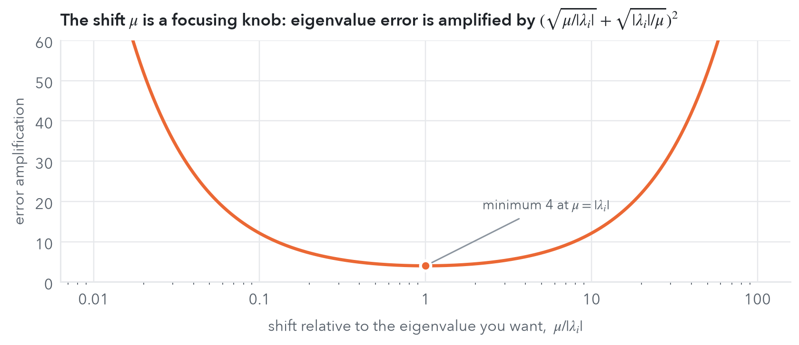
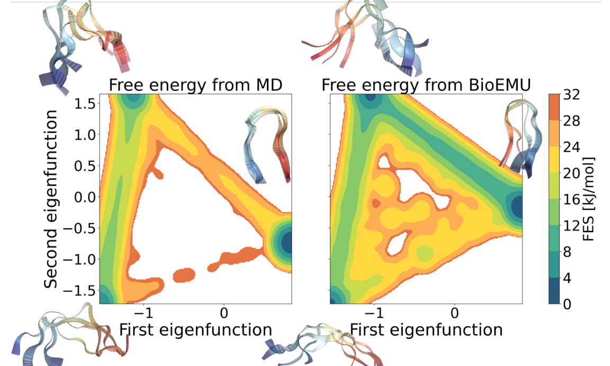
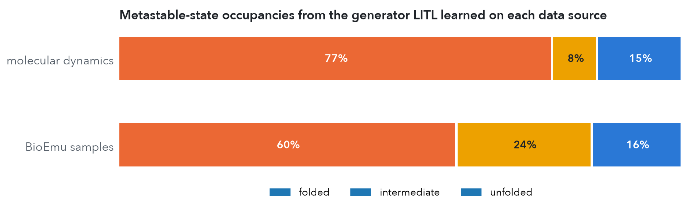

::: {.post-lede}
Some dynamics you can simulate. Others you can only glimpse. A protein-structure foundation model gives you thousands of plausible conformations, but no clock. An enhanced-sampling simulation crosses barriers quickly, but only because you pushed it with a bias. A magnetometer measures the energy of a nanomagnet, but not its trajectories. A deployed classifier can be audited, but not retrained. In every case the question is the same: **how can one recover a target system's dynamics without access to its trajectories?** Our NeurIPS 2026 paper ([arXiv:2610.01522](https://arxiv.org/abs/2610.01522)) answers it for Langevin dynamics with a method called **LITL**, Langevin-Informed Transfer Learning. This is joint work with Karim Lounici, Hélène Halconruy, Timothée Devergne, Michele Parrinello and Massimiliano Pontil.
:::

::: {.callout-tip appearance="simple" icon="false"}
## TL;DR

- **Transfer the generator, not the weights.** LITL learns the slow spectral structure of the *target* Langevin generator (its timescales and slow modes) together with the drift projected onto those modes. It only uses samples from a *different* system plus black-box evaluations of the energy difference.
- **No trajectories needed.** The generator's quadratic form is an expectation of gradients, so static, biased samples, importance weights and automatic differentiation of the features are enough. There is no lag time and no time stepping.
- **Guarantees.** Finite-sample bounds for eigenvalues, eigenfunctions and the projected drift, with neural-network features, in **Sobolev norms**. That means the derivatives are controlled too, which is what you need to *simulate* the learned dynamics.
- **Spherical LITL.** On a sphere, pure diffusion has a uniform equilibrium, so source samples are free: just normalise Gaussian vectors. This makes LITL a gradient-free way to steer normalised latent representations of trained networks.
- **Results.** Accurate higher eigenvalues on a double well where earlier methods fail. Physical timescales from biased alanine-dipeptide simulations. Kinetics for static BioEmu samples of chignolin. More than ten eigenfunctions of a cobalt nanoparticle from energy evaluations alone. About 94% of a classifier's fairness gap removed post hoc without retraining. Below there is a **live magnetization lab** where LITL runs in your browser.
:::

![**Learning the right system from the wrong data**, on a 1D double well. (a) The target system rarely crosses its barrier, so we sample a *biased* system whose bias potential V fills the barrier. (b) From those biased samples, LITL recovers the target's slowest eigenfunction, which tells you which well you are in. The same estimator without importance weights learns the biased system instead. (c) The drift learned from energy differences approaches the true force as more modes are kept. (d) The switching time: LITL gets the target's 8.1 vs the exact 8.4, while the naive estimate is 14 times too fast. Minimal re-implementation written for this post (fixed Gaussian features, LITL step 2), not the paper's neural-network code.](figs/litl-hero.png)

## Four situations, one question

| setting | what you have | what you want |
|---|---|---|
| enhanced molecular simulation (metadynamics, umbrella sampling) | trajectories of the system *pushed* by a bias potential | physical transition rates and metastable states |
| generative models of molecules (e.g. BioEmu) | static equilibrium samples, with no time | kinetics: which states, how fast between them |
| magnetic nanoparticles | energy measurements (micro-SQUID, torque magnetometry) | switching times, metastable orientations |
| a trained neural network | its latent representations and an audit oracle | a flow that steers it towards a goal, without retraining |
: {.kv-table .striped tbl-colwidths="[30,33,37]"}

Transfer learning normally moves *parameters* from one task to another, by fine-tuning, feature reuse or reweighted losses, and almost always needs target labels, target gradients or retraining. LITL moves something else: the **structure of the stochastic dynamics**.

## Langevin dynamics and its generator

The workhorse model is overdamped Langevin dynamics at inverse temperature $\beta$ in a potential $U$:

$$
dX_t=-\nabla U(X_t)\,dt+\sqrt{2\beta^{-1}}\,dW_t,\qquad \pi(dx)\propto e^{-\beta U(x)}dx .
$$

It is the model of thermal molecular motion, of stochastic gradient descent near a minimum, and of the noise process inside diffusion models. Everything about its long-time behaviour is encoded in the **infinitesimal generator**

$$
Lf=-\langle\nabla U,\nabla f\rangle+\beta^{-1}\Delta f,\qquad L=\sum_{i\ge0}\lambda_i\,\psi_i\otimes\psi_i ,
$$

which is self-adjoint in $L^2_\pi$. Its eigenvalues $0=\lambda_0>\lambda_1\ge\lambda_2\ge\dots$ are relaxation rates, so $1/|\lambda_i|$ is the $i$-th characteristic timescale. Its eigenfunctions are the **slow collective variables**: $\psi_1$ tells you which metastable basin you are in, and $|\lambda_1|$ tells you how often you leave it. Because $L$ is unbounded, we work with its **resolvent** $R_\mu=(I-\mu^{-1}L)^{-1}$. The resolvent is compact, has the same eigenfunctions, and has eigenvalues $\nu_i=\mu/(\mu-\lambda_i)$, so the slowest modes become the *largest* ones, which is what low-rank learning finds most easily.

## Why transfer at the level of the generator

Add a bias $V$ to accelerate exploration, so the source dynamics run in $U'=U+V$. At the level of generators the change is simple and *linear*:

$$
L' \;=\; L-\langle\nabla V,\nabla(\cdot)\rangle .
$$

At the level of transfer operators $T_t=e^{tL}$, which most data-driven methods learn, it is not, because $e^{tL'}\neq e^{tL}\,e^{-t\langle\nabla V,\nabla\cdot\rangle}$: the two operators do not commute. So you cannot debias a learned transfer operator, but you can debias a generator. The bias also appears as a known change of measure,

$$
\frac{d\pi}{d\pi'}(x)=\frac{e^{\beta V(x)}}{\int e^{\beta V}\,d\pi'},
$$

so every expectation under the target can be estimated from source samples with importance weights $v(x)=e^{\beta V(x)}$.

::: {.kv-keyidea}
::: {.kv-kicker}
The key identity
:::
For Langevin dynamics, the generator's quadratic form is an expectation of gradients,
$$
\langle f,(-L)g\rangle_{L^2_\pi}\;=\;\beta^{-1}\,\mathbb E_{x\sim\pi}\big[\nabla f(x)^\top\nabla g(x)\big]\;=\;\frac{1}{\beta\,\bar v}\,\mathbb E_{x'\sim\pi'}\big[v(x')\,\nabla f(x')^\top\nabla g(x')\big].
$$
There are no time derivatives and no lag times on the right-hand side. If you can sample *anything* with a known density ratio to the target and differentiate your features, you can learn the target's generator. **Trajectories are replaced by Dirichlet forms.**
:::

This is also why LITL works in the **energy (Sobolev) norm** $\|f\|^2_{\mathcal W^\mu_\pi}=\|f\|^2_{L^2_\pi}+\|\nabla f\|^2_{L^2_\pi}/(\mu\beta)$ rather than plain $L^2$. That norm is natural for the generator, it is estimable from samples, and it controls derivatives, which we will need for the drift.

## LITL in two steps

```{=html}
<div class="kv-flow">
  <div class="kv-flow-row">
    <div class="kv-flow-box"><b>Data</b><br>source samples x′ ~ π′ (biased, static, or uniform on a sphere) + black-box values V(x′), giving weights v = e<sup>βV</sup></div>
    <div class="kv-flow-arrow">→</div>
    <div class="kv-flow-box"><b>Step 1</b><br>learn features z<sub>θ</sub> with a Dirichlet-form loss</div>
    <div class="kv-flow-arrow">→</div>
    <div class="kv-flow-box"><b>Step 2</b><br>generalized eigenproblem Ĉu = ν̂ Ŵu</div>
  </div>
  <div class="kv-flow-down">↓</div>
  <div class="kv-flow-box kv-flow-out"><b>Target dynamics:</b> timescales, slow modes and projected drift, used to forecast, simulate and steer</div>
</div>
```

**Step 1: representation learning.** We look for neural features $z_\theta=(z_0^\theta,\dots,z_m^\theta)$ whose span is the leading invariant subspace of the resolvent, $R_\mu\approx Z_\theta D_\theta Z_\theta^*$. Using the identity above, the Hilbert–Schmidt approximation error in $\mathcal W^\mu_\pi$ becomes a loss over two covariance matrices estimated on *source* samples,

$$
\mathcal L_\alpha(\theta)=\operatorname{tr}\!\big[(D_\theta W_\theta)^2-2\bar v\,D_\theta C_\theta+\alpha\,(W_\theta-\bar vI)^2\big],
$$

$$
C_\theta=\mathbb E_{\pi'}\!\big[v\,z_\theta z_\theta^\top\big],\qquad
W_\theta=C_\theta+\tfrac{1}{\mu\beta}\,\mathbb E_{\pi'}\!\big[v\,J_\theta J_\theta^\top\big],
$$

where $J_\theta$ is the Jacobian of the features. **Theorem 3.1** shows this is the right objective. Its expectation is bounded below by $-\sum_{i\le m}\mu^2\bar v^2/(\mu-\lambda_i)^2$, with equality *if and only if* the features span the leading eigenfunctions. When $\alpha>0$, the optimum also returns the eigenvalues, $e^{-(d_i^\theta)^2}=\nu_i$. Splitting each batch into two independent halves gives an unbiased estimator at cost $\mathcal O(b\,m^2 d)$.

**Step 2: spectral estimation and dynamics recovery.** With the features fixed, the target's slow eigenpairs follow from a small generalized eigenvalue problem,

$$
\widehat C_\theta\,\hat u_i=\hat\nu_i\,\widehat W_\theta\,\hat u_i,\qquad \hat\lambda_i=\mu\,(1-1/\hat\nu_i),\qquad \hat\psi_i=z_\theta(\cdot)^\top\hat u_i .
$$

The drift comes from a neat observation. For the coordinate functions $f_k(x)=x_k$ we have $\partial_kU=-Lf_k$, so replacing $L$ by $\widehat L=\sum_i\hat\lambda_i\hat\psi_i\otimes\hat\psi_i$ gives the **gradient of the target potential projected onto the slow manifold**, $\widehat{\nabla U}=\widehat G z_\theta$, in closed form. From there you can forecast,

$$
\widehat{\mathbb P}[X_t\in B\mid X_0=x]=\sum_{i=0}^m e^{\hat\lambda_i t}\,\hat u_i^\top z_\theta(x)\sum_{x'_j\in B}\frac{v(x'_j)}{\bar v}\,\hat u_i^\top z_\theta(x'_j),
$$

and you can simulate *new* trajectories of the target, $d\widehat X_t=-\widehat G z_\theta(\widehat X_t)\,dt+\sqrt{2\beta^{-1}}\,dW_t$, which the data never contained.

::: {.column-margin}
**Coarse-graining, made statistical.** Keeping only the leading $m$ eigenfunctions is the spectral version of what statistical mechanics calls coarse-graining: fast modes are integrated out and you keep effective dynamics on slow collective coordinates.
:::

## Spherical LITL: steering normalised representations

On a sphere $\mathbb S^{d-1}$, Langevin dynamics needs no confining potential. Pure diffusion ($U'=0$) has the *uniform* distribution as its equilibrium, so **source samples cost nothing**: draw Gaussian vectors and normalise them. There is no integrator to tune and no long trajectory to wait for. The target potential enters only through black-box evaluations $U(x)$, and the learned spherical gradient $\nabla_{\mathbb S^{d-1}}U(e)=(I-ee^\top)\widehat Gz_\theta(e)$ drives short, geometry-respecting updates,

$$
e\;\leftarrow\;\frac{e-\gamma\,(I-ee^\top)\,\widehat G z_\theta(e)}{\big\|e-\gamma\,(I-ee^\top)\,\widehat G z_\theta(e)\big\|}.
$$

This fits modern AI well: contrastive embeddings, angular-margin classifiers and retrieval systems all store meaning in *directions*, and token dynamics in transformers can themselves be read as interacting particles on a sphere.

## What can be guaranteed

The statistical analysis needs three assumptions: the features and their derivatives are bounded, the potential is confining and the bias is bounded, and the gradient $\nabla U$ has some Sobolev regularity $p\ge1$. Writing $\mathcal E_m(\theta)$ for the representation error of step 1 and

$$
\varepsilon_n(\delta)=\tau\,e^{2\beta\|V\|_\infty}\sqrt{\frac{m\,d}{\mu\beta n}\ln\frac{m}{\delta}}
$$

for the statistical error from $n$ biased samples, **Theorem 4.1** gives, with probability $1-\delta$,

$$
\frac{|\lambda_i-\hat\lambda_i|}{|\lambda_i|}\lesssim\Big(\sqrt{\tfrac{\mu}{|\lambda_i|}}+\sqrt{\tfrac{|\lambda_i|}{\mu}}\Big)^2\big(\mathcal E_m(\theta)+\varepsilon_n(\delta)\big),
\qquad
\|\hat\psi_i-\psi_i\|_{\mathcal W^\mu_\pi}\lesssim\frac{\mathcal E_m(\theta)}{\mathrm{gap}_i}+\frac{\varepsilon_n(\delta)}{[\mathrm{gap}_i-3\mathcal E_m(\theta)]_+},
$$

and, for every $s\in[0,1]$,

$$
\|\nabla U-\widehat{\nabla U}\|_{\mathcal W^{\mu,s}_\pi}\lesssim\underbrace{\nu_{m+1}^{\frac{p-s}{2}}\,\|\nabla U\|_{\mathcal W^{\mu,p}_\pi}}_{\text{spectral truncation}}\;+\;\underbrace{\mu\,\sigma_\pi\,\nu_m^{-\frac{3+s}{2}}\big(\mathcal E_m(\theta)+\varepsilon_n(\delta)\big)}_{\text{learning}} .
$$

Three things are worth reading off these bounds.

- **The shift $\mu$ is a focusing knob.** The eigenvalue error is amplified by a factor that is smallest, equal to 4, when $\mu\approx|\lambda_i|$. You can tune the estimator to the timescale you care about.
- **The gradient error is measured in a Sobolev norm**, not only in $L^2$. When the true gradient lives in $\mathcal W^{\mu,p}_\pi$, the estimate is accurate in every weaker $\mathcal W^{\mu,s}_\pi$, $s<p$, derivatives included. This is what lets the learned drift generate dynamics rather than just fit values. To our knowledge these are the first finite-sample guarantees of this kind for eigenvalues, eigenfunctions *and* projected drift with neural networks.
- **There is an honest price for the bias**: the factor $e^{2\beta\|V\|_\infty}$. Importance weighting works best when the source is not too far from the target, and the bound says by how much.



## Experiments

### Double well: higher eigenvalues from biased data

On a 1D double well with a reference spectrum, the two existing methods for this task miss even the slowest eigenvalue by a factor of three or more, and the higher ones by large factors. LITL recovers all four leading eigenvalues within a few percent, and its eigenfunctions stay stable across random seeds.


### Alanine dipeptide: the timescale you would have gotten wrong

The slow conformational change of alanine dipeptide, along the dihedral angle $\phi$, is essentially never observed without a bias potential. Learning on biased simulations *without* reweighting gives a slowest eigenvalue of $-0.56$, a timescale of about **2**, which is physically impossible. With LITL's reweighting it becomes $-0.029$, a timescale of about **350**. Same data, same network: the only difference is that the transfer to the target generator is done correctly.

### Chignolin: giving kinetics to a generative model

BioEmu and similar foundation models now produce protein equilibrium ensembles at an unprecedented scale. But samples carry no time, and standard spectral tools like TICA need trajectories. LITL needs neither. We trained it with graph neural networks on (i) long molecular dynamics trajectories of the chignolin mini-protein and (ii) static BioEmu samples, and projected each onto its two slowest learned eigenfunctions.



Both data sources recover the same mechanisms: the first slow mode is folding, the second separates unfolded from intermediate hairpin states. The *kinetics* differ, though. BioEmu underestimates the folding barrier, and the occupancies computed from the two learned generators disagree:



So LITL does two things here: it extracts physically meaningful slow modes from static generative samples, and it gives a **kinetic test** that a generative model can pass or fail.

### Cobalt nanoparticles: a live magnetization lab

The magnetization $\mathbf m\in\mathbb S^2$ of a single-domain cobalt nanoparticle wanders thermally in an anisotropy landscape,

$$
U(\mathbf m)=-K_u\,(\mathbf m\cdot\mathbf n_u)^2+K_c\,\big(m_x^2m_y^2+m_y^2m_z^2+m_z^2m_x^2\big),
$$

with a uniaxial easy axis $\mathbf n_u$ and a cubic term. The slowest generator eigenvalue sets the **Néel relaxation time**, i.e. how long a magnetic bit survives. Data storage needs barriers above about 60 $k_BT$; magnetic hyperthermia, which heats tumours with alternating fields, depends on exactly these relaxation rates. Experimentally, anisotropy landscapes are reconstructed from switching-field measurements such as micro-SQUID magnetometry, which gives energies rather than trajectories. This is spherical LITL's home turf: uniform random directions as source samples and energy evaluations as black-box feedback.

In the paper, LITL with $n=10^4$ uniform samples recovers timescales and eigenfunctions with errors around $5\cdot10^{-3}$, including **more than ten eigenfunctions with the correct symmetry groups**. Those groups dictate how many relaxation times are degenerate.

The widget below runs a small LITL **in your browser**.

```{=html}
<div class="kv-widget" id="mag-lab">
  <p class="kv-title">Try it: magnetization lab</p>
  <p class="kv-sub"><b>Sphere:</b> every point is a magnetization direction, coloured by the energy U (dark = easy directions) or by a slow mode ψₖ estimated by LITL (blue negative, orange positive). The dashed line is the easy axis. The 500 black dots are nanoparticles whose magnetizations follow Langevin dynamics. Drag to rotate. <b>Top right:</b> relaxation times 1/|λₖ|, LITL estimate (orange) against a reference (grey ring). <b>Bottom right:</b> after all moments are saturated upwards, the mean magnetization ⟨m<sub>z</sub>⟩ of the swarm (black dots) against LITL's forecast from its spectrum (orange) and the reference forecast (grey dashes).</p>
  <div class="kv-controls">
    <label><span>K<sub>u</sub></span> <input type="range" id="mag-ku" min="0" max="1.5" step="0.05" value="1" aria-label="uniaxial anisotropy"><output id="mag-ku-out">1.00</output></label>
    <label><span>K<sub>c</sub></span> <input type="range" id="mag-kc" min="0" max="1.5" step="0.05" value="0.3" aria-label="cubic anisotropy"><output id="mag-kc-out">0.30</output></label>
    <label><span>k<sub>B</sub>T</span> <input type="range" id="mag-kt" min="0.3" max="1" step="0.01" value="0.3" aria-label="temperature"><output id="mag-kt-out">0.30</output></label>
  </div>
  <div class="kv-controls">
    <span>energy evaluations n&nbsp; <span class="kv-seg"><button type="button" data-n="500">500</button><button type="button" data-n="2000" class="on">2,000</button><button type="button" data-n="8000">8,000</button><button type="button" data-n="16000">16,000</button></span></span>
    <button type="button" class="kv-btn" id="mag-resample">New random sample</button>
  </div>
  <div class="kv-controls">
    <span>colour by&nbsp; <span class="kv-seg"><button type="button" data-color="0" class="on">energy U</button><button type="button" data-color="1">ψ₁</button><button type="button" data-color="2">ψ₂</button><button type="button" data-color="3">ψ₃</button><button type="button" data-color="4">ψ₄</button><button type="button" data-color="5">ψ₅</button><button type="button" data-color="6">ψ₆</button><button type="button" data-color="7">ψ₇</button><button type="button" data-color="8">ψ₈</button></span></span>
  </div>
  <div class="kv-controls">
    <span>swarm driven by&nbsp; <span class="kv-seg"><button type="button" data-force="true" class="on">physical force</button><button type="button" data-force="litl">force learned by LITL</button></span></span>
    <button type="button" class="kv-btn" id="mag-saturate">Saturate ↑ and release</button>
    <button type="button" class="kv-btn" id="mag-pause">Pause</button>
  </div>
  <div class="kv-panels kv-mag">
    <div class="kv-sphere" style="position:relative;width:100%;max-width:330px;margin:0 auto;aspect-ratio:1"><canvas id="mag-base" style="position:absolute;inset:0;width:100%;height:100%" aria-label="Sphere of magnetization directions"></canvas><canvas id="mag-over" style="position:absolute;inset:0;width:100%;height:100%;cursor:grab;touch-action:none" aria-label="Magnetization swarm; drag to rotate"></canvas></div>
    <div class="kv-stack" style="display:flex;flex-direction:column;gap:10px">
      <svg id="mag-spec" viewBox="0 0 260 150" style="width:100%;height:auto;display:block;background:#fff;border:1px solid #eef0f2;border-radius:8px" role="img" aria-label="Relaxation times, LITL estimate and reference"></svg>
      <canvas id="mag-relax" style="width:100%;aspect-ratio:260/150;display:block;background:#fff;border:1px solid #eef0f2;border-radius:8px" aria-label="Mean magnetization relaxation"></canvas>
    </div>
  </div>
  <p class="kv-margin" id="mag-out"></p>
</div>
<script src="magnet-widget.js?v=2"></script>
```

Things to try:

- **Lower the temperature.** τ₁ grows exponentially (Arrhenius–Néel), and ψ₁ turns into a sharp switch between the two hemispheres: it *is* the reversal coordinate.
- **Set $K_u=0$.** Pure cubic anisotropy has six equivalent easy directions, and the slowest relaxation time becomes three-fold degenerate. Raise $K_u$ slowly and watch the symmetry break: one mode (reversal along $z$) and a degenerate pair (in-plane). This is the "symmetry dictates multiplicity" effect the paper finds for the cobalt nanoparticle.
- **Change the budget n.** With 500 energy evaluations the higher modes are noisy. With 16,000 they sit on the reference rings. That is $\varepsilon_n(\delta)$ shrinking as you watch.
- **Drive the swarm with the force learned by LITL.** The swarm now moves under the projected drift $\widehat{\nabla U}$ computed from the spectrum, and it still relaxes as the forecast says.

::: {.callout-note appearance="simple" icon="false"}
**What the widget does, exactly.** LITL draws $n$ uniformly random directions, evaluates their energies, and forms importance-weighted covariances of 49 polynomial features (monomials of degree 5 and 6, which span all spherical harmonics up to degree 6) and of their tangential gradients. It then solves the generalized eigenproblem of step 2 and builds the projected drift. The paper instead *learns* the features with a neural network (step 1). A fixed dictionary keeps the demo fast in a browser. The reference uses the same features with 6,000 deterministic quadrature points. Over the slider ranges it agrees with an independent spherical-harmonic solver to better than 1%, and at the paper's setting ($K_u=1$, $K_c=0.3$, $k_BT=1$) it reproduces the paper's ground truth $\lambda_1=-1.302$, $\lambda_{2,3}=-2.48$.
:::

For comparison, here are the first three eigenfunctions LITL learned with neural features in the paper, in polar coordinates (polar angle as radius):


### Fairness steering of a trained classifier, without retraining

The last experiment moves from physics to machine learning. On the Adult Income dataset a classifier $f_\omega(x)=\mathrm{softmax}(a_\omega^\top e_\omega(x))$ predicts whether income exceeds \$50K, with gender withheld from training (fairness under unawareness). Its latent representation $e_\omega(x)$ lives on a sphere $\mathbb S^{31}$. The model is accurate but fails an equal-opportunity audit: the true-positive-rate (TPR) gap between men and women is too large.

Spherical LITL treats this as a transfer problem. The source is pure diffusion on the latent sphere, so the source samples are 5,000 uniformly random latent directions. The target potential is the local TPR gap $U(e)=|\mathrm{TPR}_{\text{male}}(\mathcal N_e)-\mathrm{TPR}_{\text{female}}(\mathcal N_e)|$ measured on the audit set around $e$. It is a black box: there is no gradient with respect to model parameters and no access to the sensitive attribute during training. LITL learns the slow eigenspaces of this "fairness Langevin dynamics" and the projected gradient, and then nudges every latent vector a few small steps along it.


The spectrum also helps with interpretation. It shows a clear gap after 16 slow eigenfunctions. About **half of the TPR gap is due to the model**, and steering along those 16 slowest directions removes it with practically no loss of accuracy. The rest reflects bias in the data itself, and correcting it needs 16 further, faster modes, which do cost accuracy.

![**Ablations and baselines** (Table 2 of the paper, mean ± std over 10 trials, relative to the original classifier). Full LITL removes 94% of the gap and keeps 97% of the accuracy, comparable to retraining or fine-tuning, which need retraining with the sensitive attribute in the loss. Replacing the generator-based update with local finite differences, dropping the audit feedback, or truncating the spectrum in the wrong place each breaks it, so importance weighting, spectral structure and generator-based updates are all necessary.](figs/litl-fairness-ablation.png)

## Why I think this matters

**Transfer learning as transfer of dynamics.** The sentence from the paper I like best is this one: *instead of transferring weights or features, LITL transfers generator structure*. The object that moves from source to target is not a parameter vector but a geometry, the slow manifold and the drift on it. That is why the same method can debias a molecular simulation, give a clock to a generative model, read the switching physics of a nanomagnet, and steer a classifier.

**It complements diffusion models.** Score-based generative models learn the pointwise score $\nabla\log p_t$ from target samples, along an artificial noising process. LITL never sees target samples. It learns a *spectrally filtered* score, governing long-time behaviour, from a different distribution plus side information, with finite-sample guarantees. Those are different jobs.

**Langevin dynamics is everywhere in AI.** Stochastic gradient descent near minima, Bayesian sampling, the forward process of diffusion models, and possibly the metastable dynamics of reasoning in large models all have Langevin-type structure. Spectral operator learning gives a principled, gradient-free way to analyse and steer such latent dynamics.

**Limitations.** LITL currently assumes reversible (gradient) Langevin dynamics, informative black-box evaluations, and an identifiable low-dimensional slow structure. Non-reversible and time-dependent dynamics are the natural next frontier.

## Paper and citation

::: {.callout-note appearance="simple" icon="false"}
**Langevin-Informed Transfer Learning: Replacing Target Samples by Black-Box Feedback**<br>
Vladimir R. Kostić, Karim Lounici, Hélène Halconruy, Timothée Devergne, Michele Parrinello, Massimiliano Pontil. *Advances in Neural Information Processing Systems (NeurIPS), 2026.*<br>
[arXiv:2610.01522](https://arxiv.org/abs/2610.01522)
:::

::: {.kv-cite}
```bibtex
@inproceedings{kostic2026litl,
  title     = {Langevin-Informed Transfer Learning: Replacing Target Samples
               by Black-Box Feedback},
  author    = {Kostic, Vladimir R. and Lounici, Karim and Halconruy, H{\'e}l{\`e}ne
               and Devergne, Timoth{\'e}e and Parrinello, Michele and Pontil, Massimiliano},
  booktitle = {Advances in Neural Information Processing Systems (NeurIPS)},
  year      = {2026},
  url       = {https://arxiv.org/abs/2610.01522}
}
```
:::

This work builds on our earlier papers on [learning the infinitesimal generator](../2024-12-30-current-research/index.qmd) of stochastic diffusions and on learning from biased simulations, and on the [Toeplitz](../2026-09-30-toeplitz-spectral-methods/index.qmd) and [optimal-transport](../2026-09-30-sgot-metric-dynamical-systems/index.qmd) views of operator learning discussed in earlier posts.

*About the figures:* the hero figure and the magnetization lab use minimal re-implementations written for this post (fixed features, LITL step 2). The double-well, chignolin-occupancy and fairness-ablation charts re-plot numbers from the paper. The chignolin, cobalt and Pareto figures are taken from the paper.
